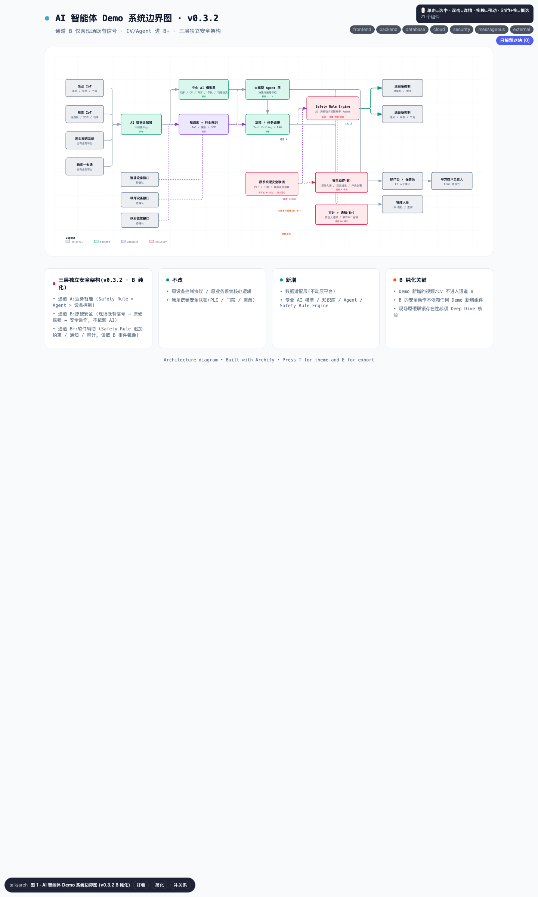
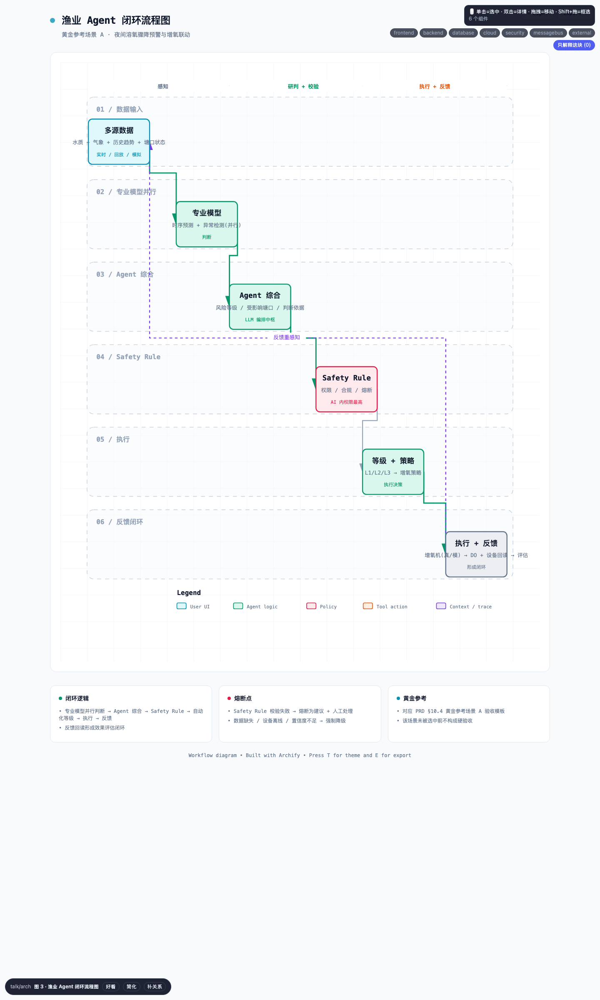
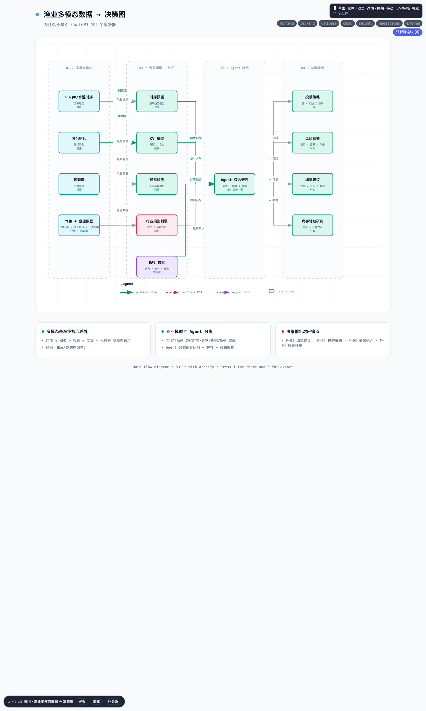
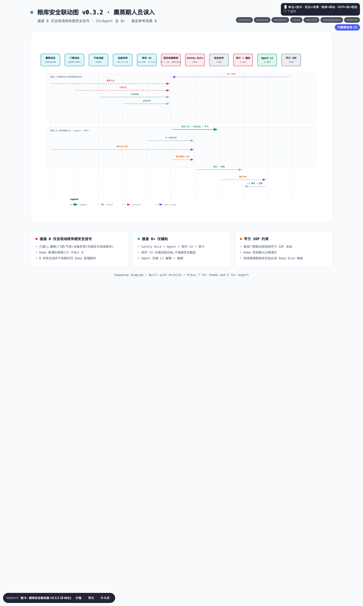
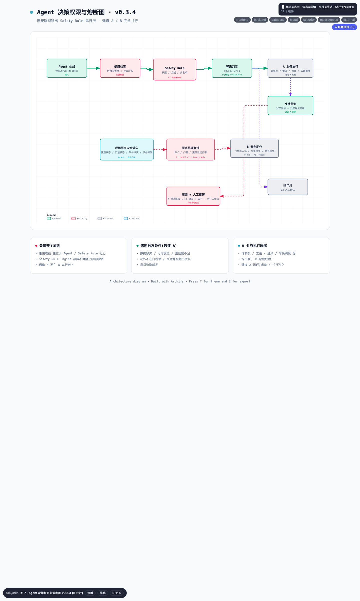

# 01 · Demo PRD（内部对齐版 · v0.3.4）

> **文档定位**：这是 Demo 的先验 PRD，不是项目实施方案。本轮要先让团队说清楚：准备验证什么、依赖什么、AI 做到哪一步、如何证明可行；不承诺最终系统能力。
>
> **v0.3.2 变更**（基于 /sol 第四轮复审，统一证据和措辞）：
> 1. **纯化 B 通道**：图 1 的 `hard_lock → audit_notify` 改为“只读事件镜像（供 B+）”；图 6 的软件视频/视觉识别移出 B，只接收现场已有信号，并明确标注“非 B 输入”。
> 2. **调整 GRAN-INT-001**：门禁接口改为“门禁系统状态只读/验证接口”；若现场 B 内部已有联动接口，该接口属于原安全系统能力，**不**由 Demo 新增。
> 3. **调整 GRAN-INT-002**：明确视频只供 Safety Rule / Agent 做 B+ 风险识别，**不**进入 B。
> 4. **精修 §9.6**：将“任一通道触发熔断”改为“通道 A / B+ 触发 Safety Rule 熔断时”，因为 B 不涉及熔断。
> 5. **修正 §10.6.2**：将“不非 AI 承接”改为“**非 AI** 承接”。
> 6. **统一 §10.6.5 的文字和公式**：明确为“认知/编排 7 步 + 治理 1 步 = 8 步”。
> 7. **补充 R-08**：Safety Rule 故障时严禁 Tool Calling 和设备控制。
> 8. **调整 §6.3**：将“Agent Framework + Tool Calling + 审计 = P0-BASE”改为“核心 P0-BASE 包括……”，避免等号造成歧义。
> 9. **修正 04 的 changelog**：将“30 P1”改为“29 P1”，使 9 + 19 + 29 = 57。
> 10. **清理 04 的重复 H1**：删除旧的 v0.3 标题。
>
> **v0.3.1 变更**（基于 /sol 第三轮复审，修复 4 个冻结阻塞项）：
> 1. **§9.4 的故障处理**：新增 §9.4.1 故障类型矩阵；Safety Rule Engine 故障时，通道 A **必须停止执行并退回人工处理（fail-closed）**，严禁 Tool Calling 和设备控制。
> 2. **拆分 §10.5 第 5 条的 B/B+**：通道 B 只包含 PLC / 门禁自身的能力（拒绝入场、应急逃生、声光告警）；通知和软件审计归入通道 B+。
> 3. **补充 §9.6.1 原硬联锁存在性**：冻结判断表——现场已有时，Demo 只读验证；现场没有时，独立 PLC、门禁或 Simulator 必须作为 P0 前置核验。
> 4. **闭合 §10.6 公式**：分母包含必须保留的人工审批治理步骤；§10.6.5 的文字与公式统一为 7 + 1 = 8。
> 5. **字段由 18 个统一为 19 个**：v0.3 新增“升级规则”列，所有文件同步。
> 6. **统一跨文件表述**：同步 03 的版本号、L94/L114 措辞和 RAG 为 P1 的定位。
>
> **v0.3 变更**（基于 /sol 第二轮复审）：
> 1. **让硬安全通道真正独立**：§9.3 改为两条**并行且独立**的链——原硬安全通道和软件安全辅助通道（Safety Rule Engine）。
> 2. **重命名并闭合承接率指标**：§10.6 改为 **AI 承接率**（全称为 AI 认知与编排承接率），明确分子、分母和边界，并冻结 Baseline 步骤粒度。
> 3. **收紧熏蒸场景**：§10.5 的 7 条验收要求全部限定为熏蒸安全，移除混入的粮情和调控内容。
> 4. **调整 PRD L36 的状态**：由 `[事实]` 改为 `[初步判断]`。
> 5. **修正 PRD L118/L241**：将 Mermaid 改为 Archify，将病害图谱改为最小检索集。
> 6. **重写 §9.5**：粮库硬安全通道由原系统硬联锁独立触发；Safety Rule 只在软件层增加约束，不作为前置条件。
>
> **配套文件**:
> - `20260624智渔粮库.md` —— 对外正式背景稿
> - `智渔粮库-项目分析整理稿.md` —— 内部材料整理稿
> - `02_项目图表.md` —— 图表索引(8 张图已拆 `charts/` 子目录)
> - `03_渔业_粮库_AI化对比分析.md` —— 11 维对比框架
> - `04_Demo需求池.md` —— 候选需求清单(本轮已按 BASE/SCENE 收敛)
> - `v0.2-审计覆盖确认.md` —— 审计追踪表
>
> **当前阶段**：已有信息整理 → 输出 PRD（本文）、图表、对比分析和需求池。深度调研、需求分类、知识图谱、Demo 方向最终确定以及数据交接，**均不在本轮冻结范围**。
>
> **读者**：内部团队。必要时可同步甲方技术负责人，但默认用于内部对齐。
>
> **状态标记约定**：
> - `[事实]` —— 材料中已经明确；
> - `[初步判断]` —— 根据现有材料推测，仍需调研确认；
> - `[目标]` —— 本次希望验证或实现；
> - `[假设]` —— 尚未验证、暂时视为成立的条件；
> - `[待确认]` —— 下一轮调研必须澄清。

---

## 1. 项目背景与 Demo 目标

### 1.1 项目背景

- `[事实]` 我司已完成空天渔场、无人化粮库两大场景的 **物联网硬件铺设和基础信息化建设**，具备数据采集、远程设备控制和阈值告警能力。
- `[初步判断]` 现有材料显示，系统目前仍以“硬件自动化 + 人工决策”为主；真实成熟度，尤其是跨系统协同和 AI 化潜力，**待接口与现场调研确认**。
- `[事实]` 当前主要问题是缺少能够综合分析和辅助决策的 AI 中枢，数据价值尚未充分释放，人工经验也限制了提质增效。
- `[目标]` 以 **共用 Agent 框架、数据接入和安全治理能力为底座**，分别建设两个场景的 AI Agent，验证从 **“人工完成主要判断和安排”** 到 **“AI 承接部分判断和安排，关键动作受控执行”** 的渐进路径。

### 1.2 Demo 目标

**Demo 是一次先验验证，核心目标有三个**：

1. **验证技术可行性**：已有物联网能力、大模型 Agent 和行业规则，能否在两个场景中跑通“感知 → 决策 → 执行”的闭环。
2. **验证痛点价值**：从背景稿的核心痛点中**选择 2–3 个代表场景**，观察 Agent 是否能带来**可观察、可解释、可闭环**的改善；其他痛点进入候选需求池，**不作为本轮 Demo 的成功前提**。
3. **验证推进路径**：Demo → 小范围试点 → 全量部署的路径是否合理。

**Demo 接受方**：甲方技术负责人，重点关注可行性，以及原文档提出的问题能否实际改善。

**Demo 的边界**：
- 证明 **部分判断和任务安排可以由 Agent 安全承接**（占比按 §10.6 计算）；
- 不把“无人渔场”或“无人粮库”作为本阶段成果；
- 背景稿中“提前 24 小时预测溶氧”“病害提前 1–3 天预警”“AI 自动补偿传感器漂移”“持续自主学习”等表述，统一**降为 P2 实验能力**，不纳入本轮硬验收。

### 1.3 项目图表（7 张 Archify + 1 张 Markdown）

- 见 `02_项目图表.md`：**7 张图由 `/talk arch`（Archify）渲染并放入 `charts/` 子目录，1 张验证矩阵保留为 Markdown 表格**。
- 不再使用 Mermaid，因为它不容易清楚表达安全链路、并行分支和双通道。

**图表总览（v0.3.4 起内嵌，正文零改动；各图与章节的对应见 `02_项目图表.md`）**：

| 图 | 对应章节 | 缩略 |
|---|---|---|
| 图 1 系统边界图 | §6.1 / §7 / §9 / §9.3 |  |
| 图 2 升级架构图 | §6.1 |  |
| 图 3 渔业闭环（黄金 A） | §6.2 / §6.3 / §10.4 |  |
| 图 4 渔业多模态 | §6.3 |  |
| 图 5 粮库闭环 | §6.2 / §6.3 |  |
| 图 6 粮库安全联动（黄金 B） | §9 / §9.3 / §10.5 |  |
| 图 7 权限与熔断 | §9.5 |  |

> 图 8 验证矩阵为 Markdown 表格（无 PNG），见 `charts/08-验证矩阵.md`，对应 §10.3–§10.6。

---

## 2. 当前系统现状

### 2.1 空天渔场(已有部分)

| 类别 | 已有项 | `[待确认]` |
|---|---|---|
| 水质传感器 | 溶氧 / pH / 水温 多参数 | 接口协议、采样频率、覆盖率 |
| 视频 | 高清食台摄像头 | 夜间覆盖能力、分辨率、存储周期 |
| 设备 | 增氧机、智能控制柜 | 控制协议、远程调用能力 |
| 气象 | 气象站 | 是否实时接入系统 |
| 软件 | 渔业溯源软件系统 | **数据接口 / 设备接口细节** |

### 2.2 无人化粮库(已有部分)

| 类别 | 已有项 | `[待确认]` |
|---|---|---|
| 粮情 | 仓内分层温湿度传感器 | **老旧仓房漂移幅度**(已知存在问题) |
| 设备 | 智能电动控制开关、环流风机、气调储粮系统 | 控制协议 |
| 出入库 | 智能地磅、RFID 识别装置 | 一卡通系统集成度 |
| 安防 | 库区视频安防系统 | 与门禁/气体传感器是否联动 |
| 软件 | 粮库一卡通管理系统 | **数据接口 / 设备接口细节** |

### 2.3 现状判断

- 两个场景**已经具备一定的设备联网和单点自动化基础**，但 AI 化成熟度和跨系统协同能力可能仍处于早期阶段；真实情况待接口与现场调研确认。
- **数据可信度**：渔业的多源数据尚未联动，粮库老旧仓房存在明确的传感器漂移问题。
- **团队能力**：`[假设]` 现有团队“全能，不构成瓶颈”。

---

## 3. 问题与 AI 机会点

> 完整痛点见 `智渔粮库-项目分析整理稿.md` 第三、四章。本节只保留对 Demo 设计最有价值的机会点。

### 3.1 空天渔场(高优机会点)

| # | 痛点 | AI 机会点 | 价值证明 |
|---|---|---|---|
| F-01 | 设备只使用水质数据，夜间溶氧骤降可能引发泛塘 | 识别异常趋势并结合多源数据 → 预警、生成增氧策略，**L2 受控联动**（L3 仅作为白名单演示） | 降低泛塘风险，争取分钟级响应 |
| F-02 | 索道定时定量投喂,无法结合生长 / 水质 / 天气动态优化 | 多模态 + 生长模型 → 动态投喂策略 | 降低饵料浪费,降低蟹群应激 |
| F-03 | 蟹病诊断依赖资深养殖户,经验难传承 | RAG + 行业知识库 + 历史病例 → 病害辅助研判 | 经验数字化沉淀 |
| F-04 | 监测盲区(夜间 / 暴雨 / 高温),异常事后发现 | 7×24h 多模态关联分析 + 时序预测 | 风险从事后转事前 |
| F-05 | 数据分散,报表人工整理 | 数据归集 + NL 查询 + 自动报告 | 降低管理成本 |

### 3.2 无人化粮库(高优机会点)

| # | 痛点 | AI 机会点 | 价值证明 |
|---|---|---|---|
| G-01 | 人工巡检频次低,熏蒸 / 高温高湿期无法进仓 | **AI 辅助持续监测,覆盖人工低频或不宜进入时段** | **降低** 人工巡检盲区 |
| G-02 | 老旧仓房传感器漂移，影响判断 | **识别漂移 + 标记/评分可信度 + 降低决策等级**（校准和自动补偿放 P2） | 让数据可信度可见 |
| G-03 | 调控粗放,绿色气调参数漂移 | 多因子寻优 → 通风窗口 / 气调参数推荐 | **验证调控策略一致性与节能潜力** |
| G-04 | 熏蒸期人员误入，门禁缺少智能管控 | 识别风险并通过 Safety Rule 通知责任人（门禁联动按甲方 SOP 冻结） | **降低人员安全风险** |
| G-05 | 出入库账实不符,旺季调度依赖人工 | 任务规划 + 全流程数据同步 | 旺季效率 + 数据闭环 |

---

## 4. Demo 范围与非范围

### 4.1 本轮范围（已冻结）

1. Demo 先验版 PRD(本文)
2. 项目图表(7 张 Archify 图 + 1 张 Markdown 验证矩阵)
3. 两模块 AI 化对比分析(11 维)
4. 候选需求池 + BASE / SCENE 需求明细(覆盖两个模块 + 共用底座)
5. Demo 验收框架(项目级硬验收 + 黄金场景验收模板 + 承接率公式)

### 4.2 本轮不冻结（留待后续阶段）

- 最终 Demo 场景选型
- 企业真实 IoT 完成度评估
- 企业 SOP / 专家知识采集
- 政府监管接口对接
- 知识图谱构建(完整病害 / 储粮图谱)
- 最终模型选型
- 正式生产 KPI 设定
- 私有化 / API 部署方案
- 试点 → 全量部署路径

---

## 5. 核心场景清单(候选,不冻结)

> 以下场景根据背景稿痛点和 `/sol` 顾问建议列为**候选**，本轮不做最终选择。黄金参考场景只作为验收模板，**场景未入选前不构成硬验收**。

| 候选场景 | 模块 | 痛点对应 | 黄金参考 |
|---|---|---|---|
| 夜间溶氧骤降预警与增氧联动 | 渔业 | F-01 | ✅ 黄金参考 A |
| 动态投喂策略(生长 + 水质 + 天气) | 渔业 | F-02 |  |
| 蟹病辅助研判与案例沉淀 | 渔业 | F-03 |  |
| 7×24h 多模态风险预警 | 渔业 | F-04 |  |
| 粮情超前研判(分层温湿度 + 仿真) | 粮库 | G-01/G-02 |  |
| 储粮环境智能调控(通风 / 气调寻优) | 粮库 | G-03 |  |
| 熏蒸期人员误入告警与人员安全联动 | 粮库 | G-04 | ✅ 黄金参考 B |
| 出入库自主协同调度 | 粮库 | G-05 |  |

`[假设]` Demo 最终在 **2–3 个核心场景** 内收敛，优先从两个黄金参考场景中选择。

---

## 6. AI Agent 能力设计

### 6.1 Agent 在系统中的位置

```
[ 既有数据 / 业务平台 ]       ← 保留，不改核心逻辑
[ AI 数据适配层 ]              ← 新增，只做必要接入
[ 物联网感知层 ]               ← 既有；老旧仓房数据需先评估可信度

═══ 通道 A：业务智能（可使用大模型）═══
[ 专业模型 ]                   ← 新增：时序、视觉、异常、寻优、物理仿真
        ├─ 各模型并行输出专业判断
[ 知识库和行业规则 ]           ← 新增，与专业模型并行提供信息
[ Agent ]                      ← 新增，综合判断并安排任务
[ 决策 / Workflow ]            ← 新增
[ Safety Rule Engine ]         ← 新增，约束通道 A 的动作

═══ 通道 B：原有硬安全（完全独立）═══
[ 原系统硬安全联锁 ]            ← 既有，**独立运行，AI 不得绕过**
[ 原设备控制系统 ]              ← 既有

═══ 通道 B+：软件辅助（补充 B）═══
[ 责任人通知 / 软件审计 ]       ← 新增，不替代通道 B

═══ 输出 ═══
[ AI 工作流 ]                   ← 新增，承接部分判断和任务安排
```

**关键判断**：
1. **Agent 负责综合判断和任务安排，不等于所有智能能力**；专业判断由专业模型完成。
2. 专业模型和知识库并行提供信息，不互相串联。
3. 原系统硬安全联锁独立运行（详见 §9.3）。
4. 每个专业模型和 Agent 都可以单独替换，彼此不耦合。

### 6.2 Agent 能力链

```
数据接入（传感器、业务系统和回放数据）
  ↓
专业判断（时序、视觉、异常、寻优和物理模型并行工作）
  ↓
综合决策（Agent 给出风险等级、优先级和策略选项）
  ↓
执行校验（Safety Rule Engine 检查权限和自动化等级，再调用接口）
  ↓
反馈（回读结果，评估效果）
  ↓
后续学习（案例整理、阈值调整——P2，不纳入 Demo 硬验收）
```

### 6.3 模块能力侧重

- **渔业**：重点处理时序、图像、视频和文本，核心难点是生物环境的不确定性。
- **粮库**：重点处理热湿传导等物理规律，并设置更严格的安全规则；数据可信度和合规是主要难点。
- **共用底座**：包括 Agent Framework、RAG 框架、Tool Calling 和审计；专业模型与自动化权限必须按模块隔离。
- **本轮 Demo 的 P0-BASE**：包括 Agent Framework、Tool Calling、Safety Rule Engine、审计、数据适配层、权限隔离、数据不可信时强制降级、可解释输出，以及按场景配置响应时限并在超时后降级。完整 9 项见 `04_Demo需求池.md` §5。**RAG / 知识库最小检索集暂列 P1**，场景入选后再升为 P0-SCENE。

---

## 7. 系统架构与集成边界

> 详见 `02_项目图表.md` 的图 1（系统边界）和图 2（物联网 → AI 升级架构）。

**关键边界**：

| 边界 | 含义 | 本轮处理 |
|---|---|---|
| Demo 修改什么 | 数据接入层、专业模型、Agent、知识库和 Safety Rule Engine | 属于本轮范围 |
| Demo 不修改什么 | 原设备控制协议、原业务系统核心逻辑、**原系统硬安全联锁** | 只做接口适配，**硬联锁不得被 AI 绕过** |
| 模拟与真实 | 真实接口暂不可用时，使用 **Device Simulator / Data Replay** | 必须明确标注 |
| 安全优先级 | **原硬安全通道独立**（通道 B）；业务通道中 Safety Rule Engine 的约束高于 Agent / Workflow | 详见 §9.3 |

---

## 8. 数据、知识与接口依赖

### 8.1 数据依赖总览

| 模块 | 数据 | 状态 | 备注 |
|---|---|---|---|
| 渔业 | 分钟级 DO / pH / 水温 | `[待确认]` | 是否可稳定接入 |
| 渔业 | 食台照片 / 视频 | `[待确认]` | 夜间覆盖 / 存储周期 |
| 渔业 | 气象(短临 + 中期) | `[假设]` 可获取 | 公开数据 |
| 渔业 | 历史投喂 / 病害 / 蟹苗生长 | `[待确认]` | 企业 SOP 与历史数据 |
| 粮库 | 仓内分层温湿度 | `[事实]` 已有 | 老旧仓房存在漂移 |
| 粮库 | 仓外气象 | `[假设]` 可获取 | 公开数据 |
| 粮库 | 仓房参数 / 储粮 | `[待确认]` | 基础元数据 |
| 粮库 | 历史粮情 / 调控记录 | `[待确认]` | 一卡通系统内 |

### 8.2 知识依赖

- **渔业知识**：病害参考病例、用药规范、应急处置 SOP 和生长模型；**完整病害知识图谱不在本轮冻结范围**，本轮只准备 §10.6 所说的 RAG 最小检索集。
- **粮库知识**：储粮技术规范、绿色储粮标准、虫害防治和应急处置预案。政府监管字段要求仍为 **`[待确认]`**。

### 8.3 接口依赖

| 模块 | 关键接口 | `[待确认]` 内容 |
|---|---|---|
| 渔业 | 渔业溯源系统(数据 / 设备) | 接口形式、协议、调用频次 |
| 渔业 | 智能控制柜 / 索道调度 | 协议、调度权限 |
| 粮库 | 一卡通系统(数据 / 设备) | 接口形式、协议 |
| 粮库 | 通风窗 / 风机 / 气调 / 地磅 / RFID / 门禁 | 控制协议、安全联动接口 |
| 粮库 | 视频安防平台 | 是否提供实时流与分析接口 |

---

## 9. Agent 权限与安全边界

### 9.1 术语约定（全项目统一）

| 术语 | 定义 | 适用对象 |
|---|---|---|
| **Agent 自动化等级 L0–L4** | Agent 对**业务动作**拥有的自主权限等级 | 只描述 Agent，不描述算法，也不描述 Safety Interlock |
| **Safety Rule Engine（安全规则引擎）** | AI 决策链中的权限、合规和熔断规则 | 软件层；位于 Agent 之上、原系统硬联锁之下 |
| **原系统硬安全联锁** | PLC、门禁或熏蒸系统自带的硬安全保护，**不依赖 LLM，也不依赖 Safety Rule Engine** | 与 AI 系统并行，**AI 不得绕过** |

**全项目统一的原则**：
> **原系统硬安全联锁独立运行，AI 不得绕过。**
> **AI 决策链内部：Safety Rule Engine > Agent / Workflow。**

### 9.2 Agent 自动化等级（L0–L4）

| 等级 | 定义 | 示例 | Demo 取值 |
|---|---|---|---|
| **L0** | 只展示信息 | 水质趋势图 | ✅ |
| **L1** | 分析并给出建议 | “建议启动增氧机” | ✅ |
| **L2** | 生成动作，由人工确认 | 操作员确认后启动设备 | ✅ **粮库高风险业务默认上限** |
| **L3** | 在白名单范围内自动执行 | 自动执行夜间低风险增氧策略 | ✅ **渔业低风险场景可选** |
| **L4** | 完全自主执行 | — | ❌ **不作为 Demo 目标** |

### 9.3 三层独立安全架构（v0.3 重写）

> **本轮关键修复**：Safety Rule Engine 不再位于原系统硬联锁之上；两条通道真正并行且相互独立。

#### 通道 A：业务智能通道（可使用大模型，依赖 Safety Rule Engine）

```
专业模型 + 知识库 / 规则
        ↓
Agent（综合判断和任务安排）
        ↓
Safety Rule Engine（权限和合规检查；约束高于 Agent）
        ↓
Agent 自动化等级判定（L0–L4）
        ↓
原设备控制系统
        ↓
回读执行结果
```

#### 通道 B：原有硬安全通道（不依赖大模型，也不依赖 Safety Rule Engine）

```
现场安全传感器 / PLC / 门禁 / 熏蒸状态 / 气体浓度 / 设备异常
        ↓
原系统硬安全联锁（PLC、门禁或熏蒸系统自带的保护）
        ↓
安全动作（拒绝未授权入场 / 保持应急逃生 / 声光告警）
```

**关键设计**：
- **通道 B 独立运行**：即使 Agent 和 Safety Rule Engine 都失效，原系统硬联锁仍应动作。
- **Safety Rule Engine 故障不得阻止原系统硬安全动作**，这是硬约束。
- 原系统硬联锁的动作**不计入 Agent 自动化等级 L0–L4**，因为它属于独立系统行为。
- 通道 A 与通道 B 可以共享事件信息，但**不能互相形成执行依赖**。

#### 通道 B+：软件安全辅助通道（可使用大模型，依赖 Safety Rule Engine）

```
同样的状态 / 事件流（与通道 B 共享输入）
        ↓
Safety Rule Engine（增加软件层约束）
        ↓
补充约束 / 通知责任人 / 审计留痕 / 辅助联动
```

**关键设计**：
- B+ 只做**辅助**，不负责触发核心安全动作；即使 B+ 失效，通道 B 仍应独立工作。
- Safety Rule Engine 在 B+ 中提供软件层的合规约束、告警和审计，不替代原硬联锁。
- Agent 在 B+ 中主要做 **L1 解释、研判、汇总和留痕**（详见 §9.5）。

> 详见 `02_项目图表.md` 图 6(粮库安全联动)、图 7(权限与熔断)。

### 9.4 Safety Rule Engine 的熔断条件（任一满足即触发，作用于通道 A 和 B+）

1. 数据缺失或可信度低；
2. 模型置信度不足；
3. 接口异常或设备离线；
4. 动作不在白名单内；
5. 风险等级超过授权阈值。

触发后，系统自动转为 **“建议 + 人工处理”**，记录审计日志并通知责任人。**熔断后必须由人工接管，Agent 不得绕过**。

#### 9.4.1 Safety Rule Engine 故障——Fail-Closed 原则（v0.3.1 修正）

> **本轮修正**：v0.3 §9.4 曾写“Safety Rule Engine 故障时，只有通道 B+ 降级，通道 A 仍由 Agent 和自动化等级自行判定”。这属于 **fail-open**，会让系统在安全规则不可用时继续执行。
>
> **正确原则**：Safety Rule Engine 故障 → **通道 A 的所有执行动作停止** → **退回 L1 只读建议 + 人工处理**；**不得进入 Tool Calling 或设备控制**。

故障类型矩阵：

| Safety Rule 状态 | 通道 A 行为 | 通道 B 行为 | 通道 B+ 行为 |
|---|---|---|---|
| **正常运行** | 业务智能正常，但执行动作必须经过 Safety Rule 校验 | 不受影响 | 正常运行 |
| **Safety Rule 触发熔断**（数据、置信度或接口异常） | 降级为 L1 建议 + 人工处理 | 不受影响 | 降级 |
| **Safety Rule Engine 故障 / 不可用** | **Fail-Closed**：停止所有执行动作 → L1 只读建议 + 人工处理；**严禁 Tool Calling 和设备控制** | 不受影响（独立运行） | 降级 |

**硬约束**：
- Safety Rule Engine 故障时，通道 A **必须 fail-closed**，绝不能 fail-open；
- 通道 B（原硬联锁）**永远不受** Safety Rule Engine 状态影响；
- 通道 B+ 的软件约束、通知和审计**一并降级**，因为它依赖 Safety Rule；
- Safety Rule 故障期间，Agent **不得绕过** Safety Rule 直接调用设备；
- **所有降级事件必须写入审计日志**（COMMON-NFR-001）。

### 9.5 模块权限默认设置

| 模块 / 业务动作 | Agent 自动化等级 | 原硬联锁通道 | Safety Rule Engine 作用 |
|---|---|---|---|
| 渔业 · 增氧 / 投喂 / 调控 | **L2**（白名单场景可演示 L3） | — | 通道 A 权限校验 |
| 粮库 · 通风 / 环流 / 气调 | **L1–L2** | — | 通道 A 权限校验 |
| **粮库 · 熏蒸作业相关业务** | **L1**（只做研判、解释和建议，不生成可直接执行的熏蒸控制命令） | **门禁、声光和应急逃生由原系统硬联锁独立执行**（通道 B） | 通道 B+ 增加软件约束、通知和留痕 |
| 粮库 · 门禁 / 安防联动 | **L1**（Agent 只生成研判和建议，不生成可执行的门禁动作） | **拒绝未授权入场、保持应急逃生能力、声光告警**（通道 B） | 通道 B+ 通知和留痕 |

### 9.6 关键安全原则（全项目统一）

- **原系统硬安全联锁独立运行，AI 不得绕过**：任何 AI 通道（A / B+）故障都不能影响 B。
- **Safety Rule Engine 故障不得阻止原系统硬安全动作**：通道 B 不依赖 Safety Rule Engine。
- **Safety Rule Engine 故障时通道 A 必须 fail-closed**：所有执行动作停止，降级为 L1 + 人工处理；不得绕过 Safety Rule 直接调用设备。
- **人工确认（L2）也不得绕过 Safety Rule**：通道 A 中，Safety Rule 的约束高于 Agent。
- **熔断后必须人工接管，AI 不得绕过**：通道 A / B+ 触发 Safety Rule 熔断时，强制转人工；通道 B 不存在 Safety Rule 熔断概念。

#### 9.6.1 通道 B 原硬安全联锁是否存在（v0.3.1 新增）

> **背景**：痛点 G-04 写的是“熏蒸期人员误入、无门禁智能管控”，而 §9.3 又假定“原系统硬联锁独立触发”，两者存在矛盾。
>
> **冻结决策**（必须现场确认）：

| 现场情况 | Demo 处理 |
|---|---|
| **现场已有原硬安全联锁** | Demo **只读状态并验证**，**不修改**安全执行链；通道 B 可以直接接入验证 |
| **现场没有原硬安全联锁** | Demo **不得**把 Safety Rule / Agent 包装成“硬安全联锁”；必须将“独立安全 PLC、门禁联锁或独立 Simulator”列为场景 B 的 **P0 核验前置条件** |

**下一轮必须验证**：现场是否已有原硬安全联锁？如果没有，采购或改造计划是什么？Demo 启动前必须明确。

---

## 10. Demo 验收与成功标准

### 10.1 技术可行性（6 个维度）

| 维度 | 核心问题 |
|---|---|
| 数据可接入性 | IoT / 业务数据能否实时或回放进入 AI |
| AI 判断有效性 | Agent 是否能识别预设风险并产生合理判断 |
| 决策可执行性 | AI 输出是否能转换为明确设备 / 业务动作 |
| 闭环能力 | 动作执行后是否可获得结果反馈 |
| 可解释与可追溯 | 为什么做这个判断 / 用了哪些数据 / 谁执行了什么 |
| 安全与降级能力 | 数据 / 模型 / 接口 / Safety Rule 异常时是否拒绝越权执行;**原硬联锁是否独立运行** |

### 10.2 业务可行性（5 个维度）

| 维度 | 核心问题 |
|---|---|
| 痛点覆盖 | 是否解决甲方真正关心的问题(候选场景层面) |
| 响应提升 | 是否比现有人工流程更快 |
| 人工工作减少 | 是否减少巡检 / 跨系统查询 / 人工判断 |
| 决策标准化 | 是否减少完全依赖个人经验 |
| 推广价值 | Demo 能否自然演进到 Pilot,而不是只能演示 |

### 10.3 项目级硬验收清单（7 条，与场景无关）

> 本节是 Demo 是否通过的硬性条件，**不依赖最终场景选型**。

1. **数据能够进入**：水质、粮情等数据可以通过真实接口、Simulator 或回放进入 Agent。
2. **Agent 输出结构化判断**：包括风险等级、判断依据、建议动作和是否需要人工确认。
3. **输出明确的动作建议**：Agent 的输出能够转换为设备或业务系统可执行的动作。
4. **执行动作必须经过 Safety Rule**：所有 Agent 生成的执行动作都要经过 Safety Rule Engine 校验，**人工确认也不得绕过 Safety Rule**。
5. **异常时能够降级**：传感器缺失、设备离线或模型置信度不足时，自动转为“建议 + 人工处理”。
6. **能够用真实接口或 Simulator 跑通闭环**：动作执行后可以回读结果并形成反馈；**通道 B 在 Agent 或 Safety Rule 故障时仍能独立触发核心安全动作**。
7. **全过程可解释、可审计**：能够回答为什么判断、使用了什么数据和规则、谁批准、设备是否执行；所有决策都有审计日志。

### 10.4 黄金参考场景 A 验收模板（夜间低氧，**场景入选后才生效**）

> 以下 7 条 **只有在场景 A 最终入选 Demo 后才作为硬验收**。

1. **数据进入 AI**：Demo 可以展示水质实时流或历史回放（可模拟）。
2. **识别异常场景**：对预置的夜间 DO 快速下降案例，**3/3 或 5/5 成功触发**（系统测试级）。
3. **输出结构化决策**：包括风险等级、受影响塘口、判断依据、建议设备、运行方式和是否需要人工确认。
4. **完成设备联动**：Agent → Safety Rule → 权限校验 → 控制接口或模拟器 → 设备状态变化。
5. **形成反馈闭环**：执行后回读 DO、设备状态和执行时间，由 Agent 评估是否达到预期效果。
6. **异常时禁止错误执行**：模拟传感器缺失、设备离线或数据异常，Agent 必须转为“建议 + 人工处理”。
7. **全过程可追溯**：能够回答为什么判断、使用了什么数据和规则、谁批准、设备是否执行。

### 10.5 黄金参考场景 B 验收模板（熏蒸误入，**场景入选后才生效**）

> 以下 7 条 **只有在场景 B 最终入选 Demo 后才作为硬验收**，并且**全部限定在熏蒸安全范围内，不混入粮情和调控内容**。

1. **接入熏蒸相关数据**：熏蒸状态、门禁状态、视频人员检测、气体浓度和设备状态。
2. **识别熏蒸期安全风险**：对历史或模拟案例识别人员进入风险区域，并生成风险等级和说明（仅 L1 研判）。
3. **识别关键输入异常**：熏蒸状态、门禁、视频/人员检测或气体数据缺失、异常时，系统必须转入更保守的策略，**不得放宽限制**。
4. **生成 L1 安全处置建议**：说明风险来源、受影响区域、禁止进入的原因、责任人和建议流程；**不生成可直接执行的熏蒸控制命令**。
5. **验证通道 B 独立触发**（v0.3.1 拆分）：
   - **通道 B**（原硬联锁，独立）：模拟熏蒸开启且人员进入 → **原系统硬联锁**独立识别 → **拒绝未授权入场、保持应急逃生、发出声光告警**（仅依靠 PLC 或门禁系统自身能力）。
   - **通道 B+**（软件辅助，依赖 Safety Rule）：读取通道 B 事件 → Safety Rule Engine 处理 → **通知责任人并留下软件审计记录**。
   - **关键原则**：Agent 或 Safety Rule Engine 故障**都不能影响通道 B**；B+ 的通知和留痕会在 Safety Rule 故障时降级。
6. **高风险动作不能由 LLM 直接执行**：Agent 只输出 L1 建议，不生成可直接执行的熏蒸控制命令。
7. **所有决策可审计**：数据、Agent 判断、Safety Rule、人工审批、设备状态、时间和最终结果都可以回查。

### 10.6 AI 认知与编排承接率——可计算口径（v0.3.1 闭环）

> 这是判断 Demo 是否真正体现价值的**项目级指标**。

#### 10.6.1 指标正式名称

> **AI 认知与编排承接率**（简称：AI 承接率）
> = Demo 后由 AI 承接的判断与任务安排步骤数 ÷ Baseline 工作流中的**全部判断、任务安排步骤 + Demo 明确保留的强制人工审批步骤**

#### 10.6.2 边界说明（明确，不混用）

| 类型 | 是否计入分母 | 计入分子 | 说明 |
|---|---|---|---|
| **纯物理设备执行** | ❌ 不计入分母 | — | 例如 PLC 直接让通风机转动 |
| **原硬安全联锁独立动作** | ❌ 不计入分母 | — | 通道 B 的动作是系统自带的硬保护，**不是 AI 承接** |
| **强制人工审批**（治理步骤） | ✅ 计入分母 | ❌ 不计入分子 | 这是刻意保留的人工环节，不代表 AI 失败 |
| **AI 承接步骤**（判断或任务安排） | ✅ 计入分母 | ✅ 计入分子 | L0 展示、L1 建议、L2 编排或 L3 自动执行 |
| **Safety Rule Engine 独立动作** | ❌ 不计入分母 | — | 属于软件安全约束，**不是 AI 主动承接** |

> **v0.3.1 闭环修正**：分母 = 判断步骤 + 任务安排步骤 + 明确保留的人工审批步骤（不含物理执行、硬联锁动作和 Safety Rule 独立动作）。保留人工审批会降低承接率，但不能为了“凑到 100%”删除安全人工节点。

#### 10.6.3 步骤粒度冻结规则

- Baseline 的步骤粒度**必须在 Demo 场景开发前冻结**（在 PRD v0.4 或后续深度调研文档中记录）；
- 不得为了提高比率在事后**拆分或合并**步骤；
- 每个步骤都要明确输入、输出和责任方；
- Demo 启动后如需调整粒度，必须走文档变更流程，并写入审计日志。

#### 10.6.4 目标值

| 目标 | 承接率 | 含义 |
|---|---|---|
| **Demo 达标** | **≥ 60%** | Demo 通过门槛 |
| **Stretch Goal** | **≥ 80%** | 锦上添花 |
| **冻结 Demo 安全负例测试集内 — 危险动作错误放行率** | **= 0** | 硬约束 |
| **冻结 Demo 安全负例测试集内 — 安全负例阻断率** | **= 100%** | 硬约束 |

#### 10.6.5 Baseline Workflow 拆解（以夜间低氧为例）

| 工作流步骤 | 当前责任方 | Demo 后责任方 | 类型 | AI 承接 | 等级 |
|---|---|---|---|---|---|
| 1. 获取 DO 趋势 | 人工查看 / 阈值告警 | 系统自动汇总 | 认知 | ✅ | L0 |
| 2. 融合气象 / 历史趋势 | 人工判断 | 模型并行判断 + Agent 综合 | 认知 | ✅ | L1 |
| 3. 判断低氧风险等级 | 人工判断 | Agent(基于专业模型输出) | 认知 | ✅ | L1 |
| 4. 生成增氧策略 | 人工决定 | Agent 推荐 | 编排 | ✅ | L1 |
| 5. 策略解释与可追溯 | 人工凭经验 | Agent 结构化输出 | 编排 | ✅ | L1 |
| 6. 执行动作审批 | 人工 | **人工(刻意保留)** | 治理 | ❌(刻意) | L2 |
| 7. 控制增氧机 | 控制系统 | 控制系统 | 物理执行 | 不计 | — |
| 8. 回读 DO / 设备状态 | 人工 | 系统自动 | 认知 | ✅ | L0 |
| 9. 闭环效果评估 | 人工 | Agent 评估 | 认知 | ✅ | L1 |

**计算**：
- 分母 = 7 个判断/任务安排步骤（1、2、3、4、5、8、9）+ **1 个强制保留的人工审批步骤（步骤 6）** = **8 步**；步骤 7 是纯物理执行，不计入。
- 分子 = 步骤 1–5、8、9 中由 AI 承接的步骤 = **7 步**。
- **承接率 = 7/8 = 87.5%**（达到 Stretch）。

> 场景 B（熏蒸）需要在 Demo 启动后按同样方法拆解 Baseline Workflow。

#### 10.6.6 关于“安全负例测试集”

- **冻结 Demo 安全负例测试集**：在 Demo 启动前预先定义一组**安全异常用例**，例如传感器故障、恶意输入、Agent 越权、Safety Rule 故障和硬联锁故障。
- **危险动作错误放行率 = 0**、**安全负例阻断率 = 100%** 只对这组已冻结的用例成立，测试集以外的情况不在本指标范围内。
- 测试集要在 Demo 启动前由安全工程师、Agent 工程师和领域专家共同确认。

---

## 11. 风险、假设与后续验证

### 11.1 假设清单（本轮暂视为成立，待验证）

| 编号 | 假设 | 不成立时的降级方案 |
|---|---|---|
| H-01 | 渔业溯源系统能提供分钟级水质数据 | 用历史数据回放 / 数据模拟器 |
| H-02 | 智能控制柜 / 索道调度可被 Agent 调用 | 用 Device Simulator |
| H-03 | 粮库一卡通系统能提供分层温湿度 + 设备状态数据 | 用历史回放 + 模拟器 |
| H-04 | 老旧仓房传感器异常可被识别到足以支持 **可信度降级和高风险动作阻断** | 无法可靠识别时,该数据源仅展示,不进入自动决策链 |
| H-05 | 粮库门禁 / 视频可提供实时联动接口 | 沙箱演示 + 标注"待对接";**通道 B 演示仍按原硬联锁** |
| H-06 | 公开气象数据可获取 | 复用已有气象站 |
| H-07 | 团队技术栈全能,不构成瓶颈 | — |

### 11.2 风险登记

| 编号 | 风险 | 影响 | 应对 |
|---|---|---|---|
| R-01 | 企业真实物联网完成度低于预期 | Demo 无法接入数据 | Device Simulator + 历史回放 |
| R-02 | 政府对接节奏不可控 | 粮库模块接口受阻 | 沙箱演示 + 监管字段待补 |
| R-03 | 技术人员抵触，经验无法整理 | 知识库质量受限 | Demo 前先内部对齐“协作而非替代” |
| R-04 | 对甲方承诺过多，后期无法兑现 | 信任受损 | 本 PRD 明确将相关能力降为 P2 |
| R-05 | 安全规则未与甲方对齐,导致越权 | 合规风险 | **原硬联锁不可被 AI 绕过**(§9.3);安全边界一级约束 |
| R-06 | LLM 幻觉导致误判 | 设备误动作 / 业务误操作 | 熔断机制 + L1–L2 默认 + 审计 + **通道 B 独立运行** |
| R-07 | 60%–80% 承接率无法量化 | Demo 价值难以证明 | §10.6 的 Baseline Workflow 拆解和步骤冻结规则 |
| R-08 | Safety Rule Engine 故障影响通道 A | 业务智能通道降级 | **通道 B 不依赖 Safety Rule;通道 A 必须 fail-closed(§9.4.1)** → 严禁 Tool Calling / 设备控制 |

### 11.3 下一轮必须验证的内容

- 企业真实 IoT 完成度 + 接口现状
- 企业 SOP / 专家知识可获取性
- 政府监管字段与对接流程
- 老旧传感器漂移幅度与覆盖比例
- 实际可用于 Demo 的数据样本(回放用例集)
- Demo 最终场景选型(本轮候选收敛到 2–3 个)
- 交接数据 / 接口清单
- Baseline Workflow 拆解(场景 A、B 各做一遍)
- 承接率基线测量(As-Is 人工流程耗时、决策步骤数等)
- 冻结 Demo 安全负例测试集

---

## 附录 A · 文档版本与维护

| 版本 | 日期 | 变更说明 | 备注 | 作者 |
|---|---|---|---|---|
| v0.1 | 2026-08-20 | 首版,基于整理稿 + /sol 顾问建议整合 | 团队对齐稿 | |
| v0.2 | 2026-08-20 | 基于 /sol 审稿反馈迭代(安全架构 / 承接率口径 / P0-BASE+SCENE / 措辞统一) | 团队对齐稿 | |
| v0.3 | 2026-08-20 | 基于 /sol 第二轮复审迭代:**硬安全通道真正解耦 / 承接率改名闭环 / 熏蒸场景去污染 / 措辞修正** | 团队对齐稿 |
| v0.3.1 | 2026-08-20 | 基于 /sol 第三轮复审迭代(冻结阻塞项 4 条):**Safety Rule fail-closed / §10.5 第 5 条 B/B+ 拆分 / 原硬联锁存在性冻结 / 承接率分母闭环 / 19 字段统一** | 团队对齐稿 |
| v0.3.2 | 2026-08-20 | 基于 /sol 第四轮复审迭代（证据一致性收口）：**纯化 B 通道（图 1 / 图 6 / GRAN-INT-001 / GRAN-INT-002）、重写图 8 熏蒸行、修正统计和措辞、补充 R-08、统一 H1 版本** | 团队对齐稿 |
| v0.3.3 | 2026-08-20 | 基于 /sol 第五轮复审：**GRAN-INT-001/002 真正落地 + 图 8 七列模型**（Internal Freeze 基线，见阶段复盘 01） | 团队对齐稿 |
| v0.3.4 | 2026-08-21 | **仅呈现变更，正文零改动**：§1.3 内嵌全部 7 张图表缩略；补录 v0.3.3 变更行使 H1 / changelog 一致 | Stage 4 解冻同批操作 |

> 本文档将在深度调研、需求分类、知识图谱和 Demo 方向确定后迭代为 v0.4。