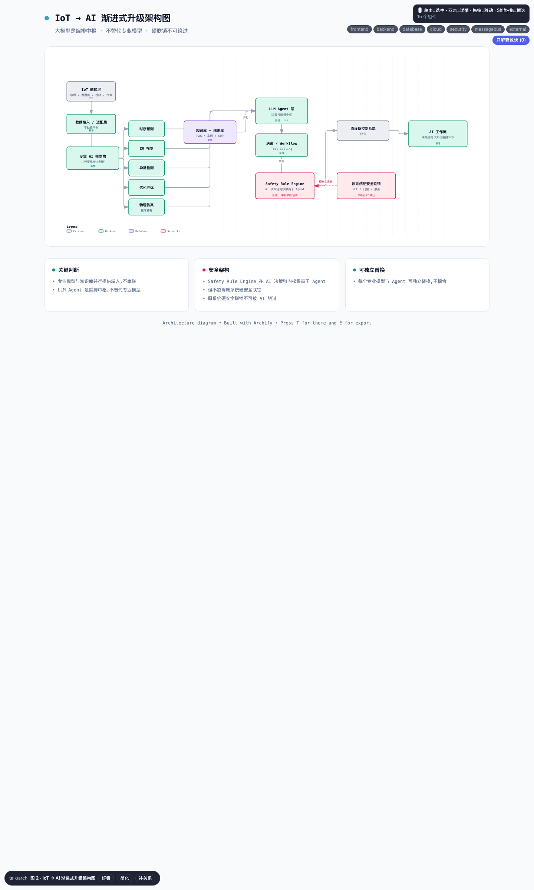

# 图 2 · 物联网到 AI 的渐进式升级架构图

> **画法**：`/talk arch`（Archify architecture 类型）· 渲染于 `2026-08-20`，v0.2
> **回答的问题**：大模型位于哪一层？为什么不能让它直接控制设备？
> **配套**：PRD §6.1（Agent 在系统中的位置）

## 关键读点

- **专业模型和知识库并行提供信息**，不互相串联，避免知识库成为专业模型的过滤器。
- **AI 智能体负责综合判断和任务编排**（黄高亮），不替代专业模型。
- **安全规则引擎**位于 AI 决策链的约束环节，权限高于智能体，但**不能越过原系统硬安全联锁**（红色）。
- **原系统硬安全联锁**始终独立，AI 无法绕过。
- 各专业模型和智能体可以单独替换，彼此不耦合。

## 跨文件引用

- 对应 `01_Demo_PRD.md` §6.1。
- 与 `02_项目图表.md` 中的图 1（系统边界）互补。