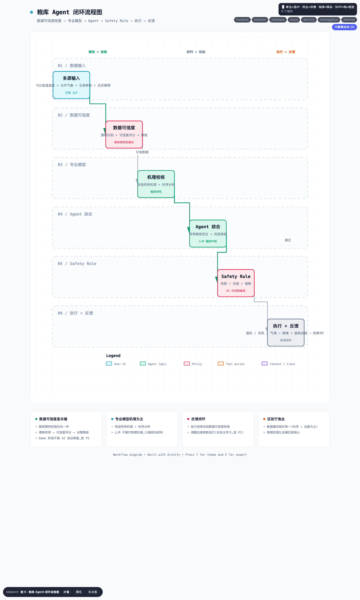

# 图 5 · 粮库智能体闭环流程图

> **画法**：`/talk arch`（Archify workflow 类型）· 渲染于 `2026-08-20`，v0.2
> **回答的问题**：粮库 AI 和渔业 AI 的决策逻辑有什么本质区别？
> **配套**：PRD §6.3（模块能力侧重——粮库）

## 关键读点

- 6 条泳道展示完整过程：**数据输入 → 数据可信度检查 → 专业模型 → 智能体 → 安全规则 → 执行与反馈**。
- **数据可信度检查**是粮库侧的重点，因为老旧传感器可能发生漂移：
  - 发现漂移 → 评估可信度 → 必要时降低决策等级。
  - Demo 阶段**不承诺 AI 自动修复**，相关能力统一放在 P2。
- **机理校核**（热湿传导和时序分析）取代渔业侧的“多模型并行”。
- 反馈会回到可信度检查，用于调整后续参数；这不是自主学习，相关能力放在 P2。

## 与图 3 的核心差异

| 维度 | 渔业（图 3） | 粮库（图 5） |
|---|---|---|
| 数据类型 | 多种数据（时序、图像、视频、文本） | 以时序和设备数据为主 |
| 核心模型 | 视觉、时序、异常检测并行 | 热湿机理 + 时序分析（物理仿真） |
| 关键风险 | 模型判断准确性 | 数据是否可信 |
| 反馈对象 | 多模型结果 | 数据可信度检查 |

## 跨文件引用

- 对应 `01_Demo_PRD.md` §3.2（粮库痛点）、§6.3。
- 对应 `03_渔业_粮库_AI化对比分析.md` 维度 6（AI 核心模型）、维度 4（数据可信度）。